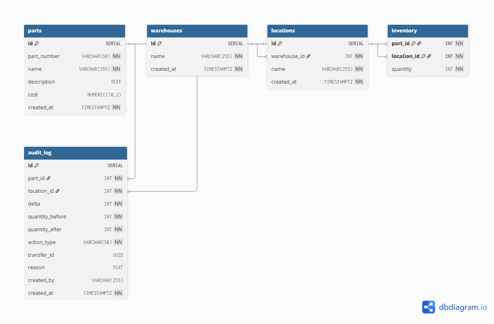

# OnRamp Solutions Assignment
## Overview
A rest API for managing parts inventory across warehouses and locations within them. Addresses manufacturing pain points such as duplicate part entries, concurrent inventory adjustments, lack of audit history, and no visibility into overall stock. Users can add parts, warehouses and locations, adjust inventory, move stock between locations, and query and audit log of all changes.

## Stack
- Node.js / Express 5
- PostgreSQL
- pg (node-postgres)

## Setup & Running
### Prerequisites
- Node v24+
- npm v11+
- PostgreSQL v18+

### Initialization
- Clone the repo (git clone https://github.com/mpolisch/onramp_assn.git)
- Open terminal, CD to installation directory and run: npm install
- Create a database named `onramp_inventory` using pgAdmin or any preferred PostgreSQL client
- Configure .env (using .env.example as a guide)
- Run in terminal: npm run migrate
- Run in terminal: npm start

## API Endpoints

| Route | Method | Required Fields | Optional Fields |
|-------|--------|-----------------|-----------------|
| /warehouses | GET | - | - |
| /warehouses | POST | `name` | - |
| /parts | GET | - | - |
| /parts | POST | `part_number`, `name` | `description`, `cost` |
| /locations | GET | - | - |
| /locations | POST | `warehouse_id`, `name` | - |
| /inventory | GET | - | - |
| /inventory/by-location | GET | - | - |
| /inventory/adjust | POST | `part_id`, `location_id`, `delta` | `reason`, `created_by` |
| /inventory/move | POST | `part_id`, `from_location_id`, `to_location_id`, `quantity` | `reason`, `created_by` |
| /audit | GET | - | `part_id` (query parameter) |

## Design Decisions

- Inventory uses a composite key consisting of (`part_id`, `location_id`). This prevents a part from having two different stock counts at the same location. Locations are also linked to warehouses with foreign keys so stock could be filtered by building.
- Every stock change (adjustment or move) goes into the same audit_log table, with moves recorded as two rows linked (one addition one deduction) by a shared UUID `transfer_id`.
- SELECT FOR UPDATE is used to lock rows for /adjust and /move, which are endpoints that have multiple statements wrapped in a transaction.
- Deltas (e.g. +5 or -3) are used in /adjust instead of setting a row total to ensure no accidental overwrites.
- Foreign keys are set to RESTRICT so that parts, locations, and warehouses cannot be deleted if they have an audit history.
- Part numbers, warehouse names, and location names are normalized to prevent duplicate similar entries (ex. "Warehouse A" and "warehouse a" being two entries)
- Upserts in /adjust had to be removed and handled with application level logic and separate SELECT and INSERT statements. This is because negative deltas triggered constraint errors for 'quantity' in inventory even though delta was being added to quantity.

## Assumptions
- No authentication
- Single currency for cost
- part_number is the unique identifier for a part
- `created_by` is a basic text field and is not required
- A move operation always moves inventory between two existing locations within the system

## Known Limitations
- Decimal input truncated by parseInt
- Parts and locations cannot be deactivated, only hard deletes blocked by RESTRICT constraints
- No request logging beyond console.error

## Future Improvements
- Authentication & user management
- Custom error class
- PUT/PATCH endpoints for parts, warehouses, and locations
- Soft-delete via an is_active flag on parts, warehouses, and locations, allowing them to be disabled without removing historical inventory or audit data